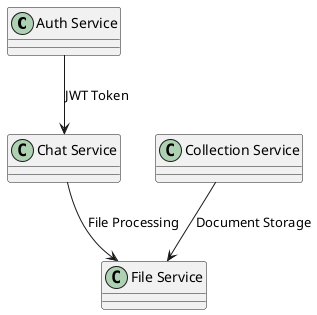

# Cursor IDE Setup Guide for Python Development

This guide provides comprehensive setup instructions for Cursor IDE with Python, FastAPI, Swagger/OpenAPI, and architecture tools.

## 📋 Table of Contents

1. [Prerequisites](#prerequisites)
2. [Extension Installation](#extension-installation)
3. [Configuration Overview](#configuration-overview)
4. [Python Development Setup](#python-development-setup)
5. [Swagger/OpenAPI Integration](#swaggeropenapi-integration)
6. [Architecture Tools](#architecture-tools)
7. [Keyboard Shortcuts](#keyboard-shortcuts)
8. [Troubleshooting](#troubleshooting)

## 🔧 Prerequisites

- **Cursor IDE** installed
- **Python 3.11+** with virtual environment
- **Git** for version control
- **Docker** (optional, for containerized development)

## 🔌 Extension Installation

### Core Python Extensions
```bash
# Install via Cursor Extensions panel or command palette
ms-python.python
ms-python.pylance
ms-python.black-formatter
ms-python.isort
ms-python.mypy-type-checker
ms-toolsai.jupyter
```

### Swagger/OpenAPI Extensions
```bash
42crunch.vscode-openapi
arjun.swagger-viewer
mermade.openapi-lint
apiaddicts.openapi-designer
humao.rest-client
rangav.vscode-thunder-client
```

### Architecture & Documentation
```bash
jebbs.plantuml
bierner.markdown-mermaid
shd101wyy.markdown-preview-enhanced
hediet.vscode-drawio
pomdtr.excalidraw-editor
```

### Development Tools
```bash
eamodio.gitlens
github.copilot
ms-azuretools.vscode-docker
```

## ⚙️ Configuration Overview

The setup includes these configuration files:

- **`.vscode/settings.json`** - IDE settings and Python configuration
- **`.vscode/extensions.json`** - Recommended extensions
- **`.vscode/launch.json`** - Debug configurations
- **`.vscode/tasks.json`** - Automated tasks
- **`.vscode/snippets/python.json`** - Code snippets
- **`.vscode/keybindings.json`** - Custom keyboard shortcuts

## 🐍 Python Development Setup

### Virtual Environment
```bash
# Create virtual environment
python -m venv .venv

# Activate (macOS/Linux)
source .venv/bin/activate

# Activate (Windows)
.venv\Scripts\activate

# Install dependencies
pip install -r requirements.txt
```

### Key Features Configured

#### Code Formatting
- **Black** for code formatting (100 character line length)
- **isort** for import sorting
- **Format on save** enabled

#### Linting & Type Checking
- **All linters disabled** - No linting errors or warnings
- **No type checking** - MyPy completely disabled
- **No security checks** - Bandit disabled
- **No static analysis** - SonarLint disabled
- **Navigation enabled** - Pylance provides go-to-definition, find references, etc.
- **Clean development experience** - Focus on code writing without interruptions

#### Testing
- **Pytest** integration
- **Coverage reporting**
- **Test discovery**
- **Debug configurations**

## 📊 Swagger/OpenAPI Integration

### Features
- **Syntax highlighting** for OpenAPI specs
- **Real-time validation**
- **Interactive preview**
- **Schema completion**
- **API testing tools**

### Usage
1. Open any `.json` or `.yaml` OpenAPI file
2. Use `Cmd+Option+S` to preview Swagger UI
3. Use REST Client extension for API testing
4. Generate documentation with tasks

### Example OpenAPI File Structure
```yaml
openapi: 3.0.0
info:
  title: Your API
  version: 1.0.0
paths:
  /api/v1/users:
    get:
      summary: Get users
      responses:
        '200':
          description: Success
```

## 🏗️ Architecture Tools

### PlantUML Integration
- Create `.puml` files in `diagrams/` directory
- Use `Cmd+Shift+P` to generate diagrams
- Server-based rendering configured

### Mermaid Diagrams
- Embedded in Markdown files
- Real-time preview
- Export capabilities

### Draw.io Integration
- Create architectural diagrams
- Export to various formats
- Version control friendly

### Example Architecture Diagram


## ⌨️ Keyboard Shortcuts (macOS)

### Python Development
- `Cmd+Shift+F` - Format code (Black)
- `Cmd+Shift+I` - Sort imports (isort)
- `Cmd+Shift+R` - Run tests
- `Cmd+Shift+C` - Run tests with coverage

### Testing
- `F5` - Start debugging

### FastAPI Development
- `Cmd+Shift+S` - Start auth service
- `Cmd+Shift+D` - Start all services (Docker)

### OpenAPI/Swagger
- `Cmd+Shift+O` - Generate Swagger docs
- `Cmd+Option+S` - Preview Swagger UI

### Architecture
- `Cmd+Shift+P` - Generate PlantUML diagrams
- `Cmd+Option+M` - Preview Mermaid diagrams

### Database
- `Cmd+Shift+M` - Run migrations
- `Cmd+Option+Shift+M` - Create migration

### Terminal & Environment
- `Cmd+Shift+\`` - New terminal
- `Cmd+Shift+E` - Setup environment

### Navigation & Search
- `Cmd+Shift+G` - Find in files
- `Cmd+Shift+H` - Replace in files

### REST Client
- `Cmd+Option+R` - Send REST request

### Git Operations
- `Cmd+Option+G` - Open source control
- `Cmd+Option+Shift+G` - Commit all

### File Operations
- `Cmd+Option+N` - New file
- `Cmd+Option+F` - New folder

## 🔍 Architecture Search Capabilities

### Code Analysis Tools
- **Dependency analysis** with `pydeps`
- **UML generation** with `pyreverse`
- **Code complexity** analysis
- **Dead code detection**

### Search Features
- **Semantic code search**
- **Symbol navigation**
- **Cross-reference finding**
- **Architecture pattern detection**

### Usage Examples
```bash
# Generate dependency graph
pydeps backend/ --show-deps

# Create UML class diagrams
pyreverse -o png backend/

# Analyze code complexity
radon cc backend/ -a
```

## 🛠️ Available Tasks

Access via `Cmd+Shift+P` → "Tasks: Run Task":

### Development Tasks
- **Python: Install Dependencies**
- **Python: Install Dev Dependencies**
- **Development: Setup Environment**

### Code Quality Tasks
- **Python: Format Code (Black)**
- **Python: Sort Imports (isort)**

### Testing Tasks
- **Python: Run Tests**
- **Python: Run Tests with Coverage**

### Service Tasks
- **FastAPI: Start Auth Service**
- **FastAPI: Start All Services**

### Database Tasks
- **Database: Run Migrations**
- **Database: Create Migration**

### Documentation Tasks
- **OpenAPI: Generate Swagger Docs**
- **Architecture: Generate PlantUML Diagrams**

## 🐛 Troubleshooting

### Common Issues

#### Python Interpreter Not Found
```bash
# Set interpreter path in settings.json
"python.defaultInterpreterPath": "./.venv/bin/python"
```

#### Extensions Not Working
1. Restart Cursor IDE
2. Check extension compatibility
3. Update extensions
4. Clear extension cache

#### Linting Errors (All Disabled)
**Note**: All linting tools are intentionally disabled in this setup. If you need linting:
```bash
# Only install if you want to enable linting
pip install black isort  # Only formatting tools are used
```

#### PlantUML Not Rendering
1. Check internet connection (uses online server)
2. Verify PlantUML syntax
3. Try local PlantUML installation

### Performance Optimization
- Exclude large directories in `settings.json`
- Use `.cursorignore` file
- Disable unused extensions
- Configure file watchers

## 📚 Additional Resources

- [Cursor IDE Documentation](https://docs.cursor.com/)
- [FastAPI Documentation](https://fastapi.tiangolo.com/)
- [OpenAPI Specification](https://swagger.io/specification/)
- [PlantUML Documentation](https://plantuml.com/)
- [Python Testing Best Practices](https://docs.pytest.org/)

## 🔄 Updates and Maintenance

### Regular Maintenance Tasks
1. Update extensions monthly
2. Review and update settings
3. Clean up unused configurations
4. Update Python dependencies
5. Review and optimize keybindings

### Version Control
- Commit `.vscode/` directory
- Use `.gitignore` for user-specific settings
- Document configuration changes
- Share setup with team members

---

**Note**: This setup is optimized for Python/FastAPI development with comprehensive tooling for API development, testing, and architecture documentation. All keyboard shortcuts are configured for macOS using `Cmd` instead of `Ctrl`. Adjust configurations based on your specific project needs.
