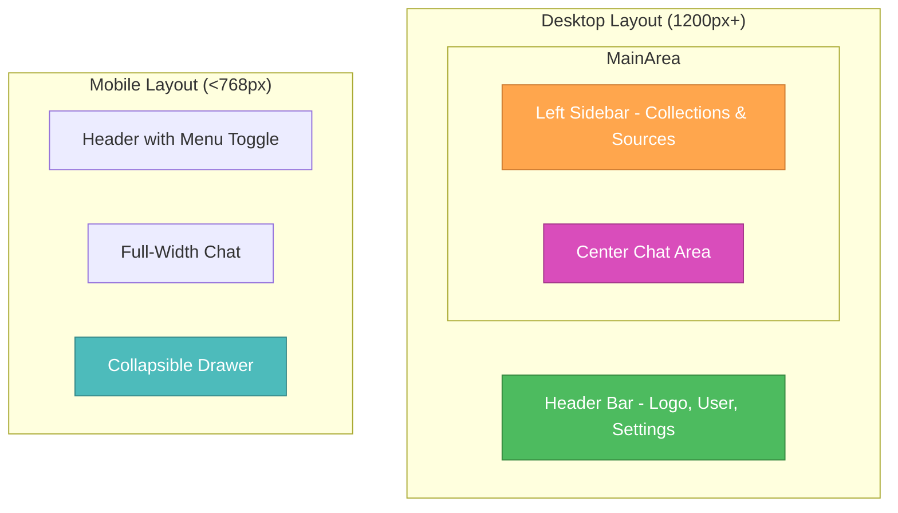

# 🎨🎨🎨 ENTERING CREATIVE PHASE: CHAT INTERFACE UX DESIGN

## Component Description
**Chat Interface UX for Advanced RAG System** - The user experience design for the AI chat interface that enables intuitive interaction with the RAG system, including conversation flow, source attribution display, collection selection, and real-time streaming responses while maintaining clarity and trust.

## Requirements & Constraints

### Functional Requirements:
- Real-time chat interface with streaming responses
- Multi-turn conversation management with context awareness
- Collection selection and management interface
- Source attribution and traceability display
- Chat history and session management
- File upload integration for new documents
- Error handling and graceful degradation
- Mobile-responsive design

### Non-Functional Requirements:
- **Usability**: Intuitive interface requiring minimal learning curve
- **Performance**: UI responsiveness < 200ms, streaming response display
- **Accessibility**: WCAG 2.1 AA compliance for inclusive design
- **Trust**: Clear source attribution and confidence indicators
- **Scalability**: Support for long conversations and multiple sessions

### Technical Constraints:
- Must work across modern browsers (Chrome, Firefox, Safari, Edge)
- Real-time streaming via WebSockets or Server-Sent Events
- Integration with authentication and RBAC systems
- Support for various screen sizes (mobile, tablet, desktop)
- Offline capability for viewing chat history

## Chat Interface Design Options Analysis

### Option 1: Traditional Chat Interface
**Description**: Standard chat layout with message bubbles, input field at bottom, minimal additional features.

**Pros**:
- Familiar user experience (WhatsApp/Slack-like)
- Simple implementation and maintenance
- Fast loading and minimal resource usage
- Clear conversation flow
- Easy to implement streaming responses

**Cons**:
- Limited space for source attribution
- No clear way to show collection context
- Difficult to display complex metadata
- Poor support for multi-collection queries
- Limited discoverability of advanced features

**Technical Fit**: Low - Insufficient for RAG system complexity
**Complexity**: Low - Standard chat implementation
**User Experience**: Medium - Familiar but limited

### Option 2: Sidebar-Enhanced Chat Interface
**Description**: Chat interface with collapsible sidebar showing sources, collections, and additional context information.

**Pros**:
- Dedicated space for source attribution
- Clear collection selection interface
- Good balance of simplicity and functionality
- Flexible layout for different screen sizes
- Maintains conversation focus while showing context

**Cons**:
- More complex layout management
- Potential information overload
- Sidebar may be ignored by users
- Requires careful responsive design
- Additional development complexity

**Technical Fit**: High - Good balance for RAG requirements
**Complexity**: Medium - Manageable with modern frameworks
**User Experience**: High - Rich functionality with clear organization

### Option 3: Multi-Panel Dashboard Interface
**Description**: Dashboard-style interface with separate panels for chat, sources, collections, and analytics.

**Pros**:
- Maximum information display
- Professional/enterprise appearance
- Excellent for power users
- Clear separation of concerns
- Rich analytics and monitoring capabilities

**Cons**:
- Overwhelming for casual users
- Complex responsive design challenges
- Higher cognitive load
- Slower initial loading
- May feel less conversational

**Technical Fit**: Medium - Over-engineered for chat focus
**Complexity**: High - Complex layout and state management
**User Experience**: Medium - Powerful but potentially overwhelming

### Option 4: Contextual Overlay Interface
**Description**: Clean chat interface with contextual overlays and modals for additional information when needed.

**Pros**:
- Clean, focused chat experience
- Context available on demand
- Good mobile experience
- Progressive disclosure of complexity
- Maintains conversation flow

**Cons**:
- Hidden functionality may be missed
- Overlay management complexity
- Potential for modal fatigue
- Difficult to show persistent context
- May interrupt conversation flow

**Technical Fit**: Medium - Good for simple use cases
**Complexity**: Medium - Overlay state management
**User Experience**: Medium - Clean but potentially hidden features

## Recommended Approach: Sidebar-Enhanced Chat Interface (Option 2)

### Rationale:
The Sidebar-Enhanced Chat Interface provides the optimal balance for the Advanced RAG System's requirements:

1. **Conversation Focus**: Maintains clear chat experience while providing rich context
2. **Source Attribution**: Dedicated space for displaying document sources and metadata
3. **Collection Management**: Intuitive interface for selecting and managing collections
4. **Scalability**: Layout adapts well to different screen sizes and use cases
5. **Progressive Disclosure**: Advanced features available but not overwhelming

### Implementation Guidelines:

#### Overall Layout Design:



#### Component Architecture:

```typescript
// Main Chat Interface Component Structure
interface ChatInterfaceProps {
  user: User;
  availableCollections: Collection[];
  initialSession?: ChatSession;
}

interface ChatInterfaceState {
  currentSession: ChatSession;
  selectedCollections: string[];
  messages: Message[];
  isStreaming: boolean;
  sidebarVisible: boolean;
  sourcesPanelVisible: boolean;
  currentSources: SourceAttribution[];
}

// Core Components
const ChatInterface: React.FC<ChatInterfaceProps> = ({
  user,
  availableCollections,
  initialSession
}) => {
  return (
    <div className="chat-interface">
      <Header user={user} />
      <div className="main-content">
        <Sidebar 
          collections={availableCollections}
          selectedCollections={selectedCollections}
          onCollectionToggle={handleCollectionToggle}
          sources={currentSources}
        />
        <ChatArea 
          messages={messages}
          isStreaming={isStreaming}
          onSendMessage={handleSendMessage}
          onSourceClick={handleSourceClick}
        />
      </div>
    </div>
  );
};
```

#### Detailed Component Designs:

##### 1. Header Component:
```typescript
const Header: React.FC<{user: User}> = ({ user }) => {
  return (
    <header className="chat-header">
      <div className="header-left">
        <Logo />
        <h1>Knowledge Assistant</h1>
      </div>
      <div className="header-center">
        <SessionIndicator currentSession={currentSession} />
      </div>
      <div className="header-right">
        <NotificationBell />
        <UserMenu user={user} />
        <SettingsButton />
      </div>
    </header>
  );
};
```

##### 2. Sidebar Component:
```typescript
const Sidebar: React.FC<SidebarProps> = ({
  collections,
  selectedCollections,
  sources,
  onCollectionToggle
}) => {
  return (
    <aside className="sidebar">
      <div className="sidebar-section">
        <h3>Knowledge Collections</h3>
        <CollectionSelector 
          collections={collections}
          selected={selectedCollections}
          onToggle={onCollectionToggle}
        />
      </div>
      
      <div className="sidebar-section">
        <h3>Sources</h3>
        <SourcesList sources={sources} />
      </div>
      
      <div className="sidebar-section">
        <h3>Quick Actions</h3>
        <QuickActions />
      </div>
    </aside>
  );
};
```

##### 3. Chat Area Component:
```typescript
const ChatArea: React.FC<ChatAreaProps> = ({
  messages,
  isStreaming,
  onSendMessage,
  onSourceClick
}) => {
  return (
    <main className="chat-area">
      <div className="messages-container">
        <MessageList 
          messages={messages}
          onSourceClick={onSourceClick}
        />
        {isStreaming && <StreamingIndicator />}
      </div>
      
      <div className="input-area">
        <MessageInput 
          onSend={onSendMessage}
          disabled={isStreaming}
          placeholder="Ask a question about your knowledge collections..."
        />
      </div>
    </main>
  );
};
```

#### Message Design Patterns:

##### User Message:
```typescript
const UserMessage: React.FC<{message: UserMessage}> = ({ message }) => {
  return (
    <div className="message user-message">
      <div className="message-content">
        <p>{message.text}</p>
        {message.selectedCollections.length > 0 && (
          <div className="query-context">
            <span>Searching in: </span>
            {message.selectedCollections.map(collection => (
              <CollectionBadge key={collection.id} collection={collection} />
            ))}
          </div>
        )}
      </div>
      <div className="message-meta">
        <time>{formatTime(message.timestamp)}</time>
      </div>
    </div>
  );
};
```

##### AI Response Message:
```typescript
const AIMessage: React.FC<{message: AIMessage}> = ({ message }) => {
  return (
    <div className="message ai-message">
      <div className="message-avatar">
        <AIAvatar />
      </div>
      <div className="message-content">
        <div className="response-text">
          <MarkdownRenderer content={message.text} />
        </div>
        
        {message.sources && message.sources.length > 0 && (
          <div className="sources-section">
            <h4>Sources:</h4>
            <SourcesList 
              sources={message.sources}
              compact={true}
              onSourceClick={onSourceClick}
            />
          </div>
        )}
        
        <div className="response-actions">
          <button className="action-btn" onClick={() => copyToClipboard(message.text)}>
            <CopyIcon /> Copy
          </button>
          <button className="action-btn" onClick={() => regenerateResponse(message.id)}>
            <RefreshIcon /> Regenerate
          </button>
          <button className="action-btn" onClick={() => provideFeedback(message.id)}>
            <ThumbsUpIcon /> Helpful
          </button>
        </div>
      </div>
      <div className="message-meta">
        <time>{formatTime(message.timestamp)}</time>
        <ConfidenceIndicator score={message.confidence} />
      </div>
    </div>
  );
};
```

#### Source Attribution Design:

```typescript
const SourceAttribution: React.FC<{source: Source}> = ({ source }) => {
  return (
    <div className="source-item" onClick={() => openSource(source)}>
      <div className="source-icon">
        <FileTypeIcon type={source.fileType} />
      </div>
      <div className="source-content">
        <h4 className="source-title">{source.filename}</h4>
        <p className="source-excerpt">{source.excerpt}</p>
        <div className="source-meta">
          <span className="collection-name">{source.collectionName}</span>
          <span className="relevance-score">
            Relevance: {(source.relevanceScore * 100).toFixed(0)}%
          </span>
        </div>
      </div>
      <div className="source-actions">
        <button className="btn-icon" onClick={(e) => {
          e.stopPropagation();
          openInNewTab(source);
        }}>
          <ExternalLinkIcon />
        </button>
      </div>
    </div>
  );
};
```

#### Collection Selection Interface:

```typescript
const CollectionSelector: React.FC<CollectionSelectorProps> = ({
  collections,
  selected,
  onToggle
}) => {
  const [searchTerm, setSearchTerm] = useState('');
  const filteredCollections = collections.filter(c => 
    c.name.toLowerCase().includes(searchTerm.toLowerCase())
  );

  return (
    <div className="collection-selector">
      <div className="search-box">
        <SearchIcon />
        <input 
          type="text"
          placeholder="Search collections..."
          value={searchTerm}
          onChange={(e) => setSearchTerm(e.target.value)}
        />
      </div>
      
      <div className="collections-list">
        {filteredCollections.map(collection => (
          <CollectionItem 
            key={collection.id}
            collection={collection}
            selected={selected.includes(collection.id)}
            onToggle={() => onToggle(collection.id)}
          />
        ))}
      </div>
      
      <div className="selection-summary">
        <span>{selected.length} of {collections.length} selected</span>
        <button onClick={() => onToggle('all')}>
          {selected.length === collections.length ? 'Deselect All' : 'Select All'}
        </button>
      </div>
    </div>
  );
};
```

#### Streaming Response Implementation:

```typescript
const StreamingMessage: React.FC<{messageId: string}> = ({ messageId }) => {
  const [streamedContent, setStreamedContent] = useState('');
  const [isComplete, setIsComplete] = useState(false);

  useEffect(() => {
    const eventSource = new EventSource(`/api/chat/stream/${messageId}`);
    
    eventSource.onmessage = (event) => {
      const data = JSON.parse(event.data);
      
      if (data.type === 'content') {
        setStreamedContent(prev => prev + data.content);
      } else if (data.type === 'complete') {
        setIsComplete(true);
        eventSource.close();
      }
    };

    return () => eventSource.close();
  }, [messageId]);

  return (
    <div className="streaming-message">
      <MarkdownRenderer content={streamedContent} />
      {!isComplete && <TypingIndicator />}
    </div>
  );
};
```

#### Mobile-Responsive Design:

```css
/* Mobile-First Responsive Design */
.chat-interface {
  display: flex;
  flex-direction: column;
  height: 100vh;
}

.main-content {
  display: flex;
  flex: 1;
  overflow: hidden;
}

.sidebar {
  width: 300px;
  background: #f8f9fa;
  border-right: 1px solid #e9ecef;
  transition: transform 0.3s ease;
}

.chat-area {
  flex: 1;
  display: flex;
  flex-direction: column;
}

/* Mobile Styles */
@media (max-width: 768px) {
  .sidebar {
    position: fixed;
    top: 60px;
    left: 0;
    height: calc(100vh - 60px);
    transform: translateX(-100%);
    z-index: 1000;
  }
  
  .sidebar.open {
    transform: translateX(0);
  }
  
  .chat-area {
    width: 100%;
  }
  
  .message {
    margin: 0.5rem;
    padding: 0.75rem;
  }
  
  .sources-section {
    margin-top: 1rem;
  }
}

/* Tablet Styles */
@media (min-width: 769px) and (max-width: 1024px) {
  .sidebar {
    width: 250px;
  }
  
  .message {
    margin: 0.75rem;
    padding: 1rem;
  }
}
```

#### Accessibility Features:

```typescript
// Accessibility enhancements
const AccessibleChatInterface = () => {
  return (
    <div 
      className="chat-interface"
      role="application"
      aria-label="Knowledge Assistant Chat"
    >
      <div 
        className="messages-container"
        role="log"
        aria-live="polite"
        aria-label="Conversation history"
      >
        {messages.map(message => (
          <div 
            key={message.id}
            role="article"
            aria-label={`${message.sender} message`}
          >
            {/* Message content */}
          </div>
        ))}
      </div>
      
      <div className="input-area">
        <label htmlFor="message-input" className="sr-only">
          Type your message
        </label>
        <input
          id="message-input"
          type="text"
          aria-describedby="input-help"
          placeholder="Ask a question..."
        />
        <div id="input-help" className="sr-only">
          Press Enter to send your message
        </div>
      </div>
    </div>
  );
};
```

## Verification Checkpoint

### Requirements Coverage:
- ✅ **Real-time Chat**: Streaming responses with WebSocket/SSE implementation
- ✅ **Source Attribution**: Dedicated display area with clear traceability
- ✅ **Collection Selection**: Intuitive interface with search and filtering
- ✅ **Multi-turn Conversations**: Context-aware message history
- ✅ **Mobile Responsive**: Adaptive layout for all screen sizes
- ✅ **Accessibility**: WCAG 2.1 AA compliance features

### User Experience Quality:
- ✅ **Intuitive Navigation**: Familiar chat patterns with enhanced functionality
- ✅ **Information Hierarchy**: Clear organization of chat, sources, and collections
- ✅ **Progressive Disclosure**: Advanced features available without overwhelming
- ✅ **Visual Feedback**: Loading states, streaming indicators, confidence scores
- ✅ **Error Handling**: Graceful degradation and clear error messages

### Technical Feasibility:
- ✅ **Modern Framework Support**: React/Vue.js compatible component architecture
- ✅ **Performance Optimization**: Efficient rendering and state management
- ✅ **Browser Compatibility**: Works across all modern browsers
- ✅ **Responsive Design**: Mobile-first approach with breakpoint optimization

### Implementation Readiness:
- ✅ Component architecture and interfaces defined
- ✅ Responsive design patterns specified
- ✅ Accessibility features documented
- ✅ Streaming implementation approach outlined
- ✅ Mobile and desktop layouts designed

# 🎨🎨🎨 EXITING CREATIVE PHASE: CHAT INTERFACE UX DESIGN

**Decision**: Sidebar-Enhanced Chat Interface with responsive design, comprehensive source attribution, and accessibility features
**Next**: All major creative phases complete - Ready for Implementation Phase 