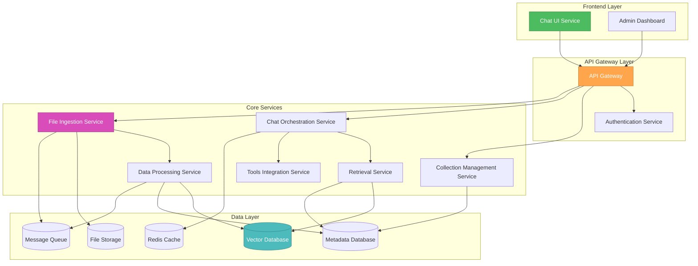

# 🎨🎨🎨 ENTERING CREATIVE PHASE: SYSTEM ARCHITECTURE DESIGN

## Component Description
**System Architecture for Advanced RAG System** - The overall system design that defines how the 6 major subsystems (File Ingestion, Data Preparation, Knowledge Collection Management, Retrieval & Augmentation, AI Chat Interface, External Tools Integration) interact, communicate, and scale together to deliver a comprehensive RAG solution.

## Requirements & Constraints

### Functional Requirements:
- Support 6 distinct subsystems with clear separation of concerns
- Handle file processing pipeline from ingestion to vector storage
- Enable real-time chat interface with streaming responses
- Support multi-collection querying with context merging
- Provide RBAC and version control capabilities
- Optional external tools integration

### Non-Functional Requirements:
- **Performance**: End-to-end response < 3.0s (P95), 50 concurrent QPS
- **Scalability**: Horizontal scaling, terabytes of data, billions of vectors
- **Reliability**: 99.9% uptime, fault tolerance, graceful degradation
- **Security**: RBAC, encryption at rest/transit, audit logging
- **Maintainability**: Modular design, well-defined APIs, extensibility

### Technical Constraints:
- Must integrate with external LLM APIs (OpenAI, Anthropic, Gemini)
- Must support multiple vector databases (Qdrant, Pinecone, Weaviate)
- File size limit: 100MB per file
- Must handle multiple file types with specialized processing
- Real-time streaming requirements for chat interface

## Architecture Options Analysis

### Option 1: Monolithic Architecture
**Description**: Single deployable unit containing all subsystems with shared database and in-process communication.

**Pros**:
- Simpler deployment and operations
- Lower latency for inter-component communication
- Easier transaction management across components
- Reduced infrastructure complexity
- Faster initial development

**Cons**:
- Limited scalability (scale entire system, not individual components)
- Technology lock-in (all components must use same tech stack)
- Difficult to maintain as system grows
- Single point of failure
- Challenging team coordination for large development teams
- Difficult to optimize individual components

**Technical Fit**: Low - Complex system with diverse requirements
**Complexity**: Low - Simple to deploy and manage initially
**Scalability**: Low - Cannot scale components independently

### Option 2: Microservices Architecture
**Description**: Distributed system with each major subsystem as independent service, communicating via APIs and message queues.

**Pros**:
- Independent scaling of components based on load
- Technology diversity (choose best tech for each service)
- Independent deployment and updates
- Fault isolation (failure in one service doesn't crash entire system)
- Team autonomy (different teams can own different services)
- Better resource utilization

**Cons**:
- Increased operational complexity
- Network latency between services
- Distributed system challenges (eventual consistency, distributed transactions)
- More complex monitoring and debugging
- Service discovery and configuration management overhead

**Technical Fit**: High - Matches complex system requirements
**Complexity**: High - Requires sophisticated operations
**Scalability**: High - Independent component scaling

### Option 3: Modular Monolith
**Description**: Single deployable unit with well-defined internal modules and clear boundaries, but with ability to extract services later.

**Pros**:
- Simpler deployment than microservices
- Clear module boundaries enable future extraction
- Easier development and testing than distributed system
- Good performance with in-process communication
- Gradual migration path to microservices

**Cons**:
- Still limited scalability compared to microservices
- Risk of module boundaries degrading over time
- Shared database can become bottleneck
- Technology constraints across modules
- Deployment coupling (all modules deploy together)

**Technical Fit**: Medium - Good compromise for complex system
**Complexity**: Medium - Moderate operational complexity
**Scalability**: Medium - Limited but better than pure monolith

### Option 4: Event-Driven Architecture with Microservices
**Description**: Microservices architecture with asynchronous event-driven communication for loose coupling and high scalability.

**Pros**:
- Excellent scalability and fault tolerance
- Loose coupling between services
- Natural fit for file processing pipeline
- Event sourcing enables audit trails and replay
- Supports complex workflows and business processes
- High throughput for async operations

**Cons**:
- Highest operational complexity
- Eventual consistency challenges
- Complex debugging and monitoring
- Event schema evolution challenges
- Potential for event storms or cascading failures
- Requires sophisticated event infrastructure

**Technical Fit**: High - Excellent for file processing and RAG workflows
**Complexity**: Very High - Requires advanced operations expertise
**Scalability**: Very High - Excellent horizontal scaling

## Recommended Approach: Microservices Architecture (Option 2)

### Rationale:
The Advanced RAG System's complexity, diverse technical requirements, and scalability needs make microservices the optimal choice:

1. **Component Diversity**: Each subsystem has distinct technical requirements (file processing, vector operations, real-time chat, ML inference)
2. **Scalability Requirements**: Different components will have different load patterns (file ingestion vs. chat queries)
3. **Technology Optimization**: Vector databases, LLM APIs, and file processing each benefit from specialized technology choices
4. **Team Scalability**: Multiple teams can work independently on different services
5. **Fault Isolation**: Critical for 99.9% uptime requirement

### Implementation Guidelines:

#### Service Decomposition:

#### Service Definitions:

1. **File Ingestion Service**
   - Responsibilities: File upload, MIME detection, checksum calculation, duplicate detection
   - Technology: FastAPI, async file handling, S3 integration
   - Scaling: CPU-bound, scale based on upload volume

2. **Data Processing Service**
   - Responsibilities: Text extraction, chunking, embedding generation, vector storage
   - Technology: Python, specialized libraries (PyMuPDF, Whisper), GPU for embeddings
   - Scaling: GPU/CPU intensive, queue-based processing

3. **Collection Management Service**
   - Responsibilities: CRUD operations, version control, RBAC, configuration management
   - Technology: FastAPI, PostgreSQL, Git-like versioning
   - Scaling: Low load, standard web service scaling

4. **Retrieval Service**
   - Responsibilities: Vector similarity search, metadata filtering, context ranking
   - Technology: Python, vector database clients, ranking algorithms
   - Scaling: Query volume dependent, cache-heavy

5. **Chat Orchestration Service**
   - Responsibilities: Session management, context merging, LLM integration, streaming
   - Technology: FastAPI, WebSockets, LLM API clients
   - Scaling: Real-time requirements, connection-based scaling

6. **Tools Integration Service** (Optional)
   - Responsibilities: Tool registration, secure execution, MCP protocol
   - Technology: FastAPI, sandboxed execution, security policies
   - Scaling: Based on tool usage patterns

#### Communication Patterns:

1. **Synchronous (REST/GraphQL)**:
   - User-facing operations (chat, collection management)
   - Real-time requirements (search, retrieval)

2. **Asynchronous (Message Queue)**:
   - File processing pipeline
   - Background tasks (re-indexing, cleanup)
   - Event notifications

3. **Streaming (WebSockets)**:
   - Real-time chat responses
   - File upload progress
   - System monitoring

#### Data Management Strategy:

1. **Database per Service**:
   - Collection Management: PostgreSQL (ACID compliance for configurations)
   - File Metadata: PostgreSQL (relational queries, RBAC)
   - Vector Data: Qdrant/Pinecone (specialized vector operations)
   - Session Data: Redis (fast access, TTL support)

2. **Shared Data Considerations**:
   - File storage: Shared S3-compatible storage with service-specific prefixes
   - Vector embeddings: Shared vector database with namespace isolation
   - Audit logs: Centralized logging system

#### Security Architecture:

1. **Authentication & Authorization**:
   - OAuth 2.0/OpenID Connect at API Gateway
   - JWT tokens for service-to-service communication
   - RBAC enforcement at service level

2. **Network Security**:
   - Service mesh (Istio) for encrypted inter-service communication
   - Network policies for service isolation
   - API Gateway as single entry point

3. **Data Security**:
   - Encryption at rest for all databases
   - TLS 1.3 for all communications
   - Secrets management (HashiCorp Vault)

#### Deployment Strategy:

1. **Containerization**:
   - Docker containers for all services
   - Kubernetes for orchestration
   - Helm charts for deployment management

2. **Environment Strategy**:
   - Development: Single-node Kubernetes (minikube/kind)
   - Staging: Multi-node cluster with production-like data
   - Production: Multi-zone Kubernetes cluster with auto-scaling

3. **CI/CD Pipeline**:
   - GitOps workflow with ArgoCD
   - Automated testing (unit, integration, e2e)
   - Blue-green deployments for zero-downtime updates

## Verification Checkpoint

### Requirements Coverage:
- ✅ **Scalability**: Microservices enable independent scaling of components
- ✅ **Performance**: Optimized communication patterns and caching strategies
- ✅ **Reliability**: Fault isolation and redundancy at service level
- ✅ **Security**: Comprehensive security architecture with defense in depth
- ✅ **Maintainability**: Clear service boundaries and technology choices
- ✅ **Extensibility**: New services can be added without affecting existing ones

### Technical Feasibility:
- ✅ **Proven Architecture**: Microservices pattern well-established for complex systems
- ✅ **Technology Maturity**: All proposed technologies are production-ready
- ✅ **Team Capability**: Architecture supports multiple development teams
- ✅ **Operational Readiness**: Kubernetes ecosystem provides necessary tooling

### Risk Assessment:
- **Medium Risk**: Operational complexity requires DevOps expertise
- **Low Risk**: Technology choices are well-supported and documented
- **Medium Risk**: Distributed system debugging requires sophisticated monitoring
- **Mitigation**: Comprehensive observability stack and gradual rollout strategy

### Implementation Readiness:
- ✅ All major services identified with clear responsibilities
- ✅ Communication patterns defined for different interaction types
- ✅ Data management strategy addresses consistency and isolation needs
- ✅ Security architecture provides comprehensive protection
- ✅ Deployment strategy supports development through production

# 🎨🎨🎨 EXITING CREATIVE PHASE: SYSTEM ARCHITECTURE DESIGN

**Decision**: Microservices Architecture with 6 core services, API Gateway, and comprehensive data/security strategy
**Next**: Proceed to Vector Database Schema Design creative phase 