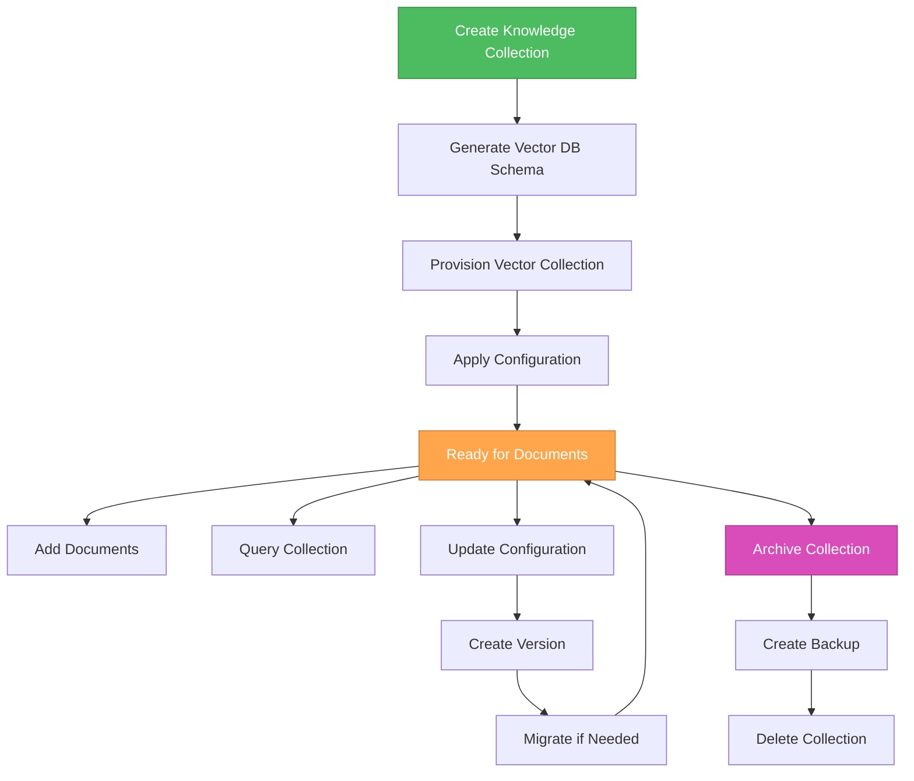

# 🎨🎨🎨 ENTERING CREATIVE PHASE: VECTOR DATABASE SCHEMA DESIGN

## Component Description
**Vector Database Schema for Advanced RAG System** - The data model and organization strategy for storing document embeddings, metadata, and enabling efficient similarity search across multiple Knowledge Collections with proper isolation, filtering, and performance optimization.

## Requirements & Constraints

### Functional Requirements:
- Store billions of vector embeddings with associated metadata
- Support multiple Knowledge Collections with isolation
- Enable fast similarity search with metadata filtering
- Support different embedding models per collection
- Provide efficient batch operations for ingestion
- Enable collection-level configuration and versioning

### Non-Functional Requirements:
- **Performance**: Vector search < 750ms (P95), support 50 QPS
- **Scalability**: Billions of vectors, terabytes of data
- **Consistency**: Strong consistency for metadata, eventual consistency acceptable for vectors
- **Availability**: 99.9% uptime with horizontal scaling
- **Security**: Collection-level access control and data isolation

### Technical Constraints:
- Must support multiple vector databases (Qdrant, Pinecone, Weaviate)
- Different embedding dimensions per collection (768, 1536, 3072)
- Metadata filtering requirements for complex queries
- Collection isolation for multi-tenancy
- Version control for collection configurations

## Vector Database Options Analysis

### Option 1: Single Collection with Metadata Filtering
**Description**: Store all vectors in a single collection/index, use metadata fields to distinguish between Knowledge Collections and apply filtering.

**Pros**:
- Simple schema design and management
- Single index to maintain and optimize
- Cross-collection search capabilities
- Unified vector space for potential cross-collection insights
- Simpler backup and recovery

**Cons**:
- No true isolation between collections
- Metadata filtering adds query overhead
- Difficult to apply collection-specific optimizations
- Security risks (metadata filtering bypass could expose data)
- Challenging to handle different embedding models
- Performance degradation as data grows

**Technical Fit**: Low - Insufficient isolation and security
**Complexity**: Low - Simple to implement initially
**Scalability**: Medium - Single index limitations at scale

### Option 2: Collection per Knowledge Collection
**Description**: Create separate vector database collections/indexes for each Knowledge Collection, with collection-specific schemas and configurations.

**Pros**:
- True isolation between Knowledge Collections
- Collection-specific optimizations (embedding model, index parameters)
- Independent scaling and maintenance
- Enhanced security through physical separation
- Easier to implement RBAC at collection level
- Simplified backup/restore per collection

**Cons**:
- More complex management (multiple collections)
- Cross-collection queries require multiple searches and merging
- Potential resource overhead for many small collections
- More complex monitoring and maintenance
- Collection creation/deletion overhead

**Technical Fit**: High - Excellent isolation and security
**Complexity**: Medium - Manageable with proper tooling
**Scalability**: High - Independent scaling per collection

### Option 3: Hybrid Approach with Namespaces
**Description**: Use vector database namespace/tenant features where available, with fallback to separate collections for databases without native multi-tenancy.

**Pros**:
- Leverages native database features where available
- Good balance of isolation and management simplicity
- Consistent API across different vector databases
- Efficient resource utilization
- Native security features where supported

**Cons**:
- Database-specific implementation differences
- Limited by least-common-denominator features
- Potential vendor lock-in for advanced features
- Complex abstraction layer required
- Namespace limitations in some databases

**Technical Fit**: Medium - Depends on database capabilities
**Complexity**: High - Complex abstraction layer
**Scalability**: High - Leverages native features

### Option 4: Sharded Collections with Routing
**Description**: Implement custom sharding strategy across multiple collections based on collection ID, with intelligent routing layer.

**Pros**:
- Excellent scalability through horizontal partitioning
- Load distribution across multiple indexes
- Flexible sharding strategies
- Can optimize shard size and configuration
- Supports very large scale deployments

**Cons**:
- High implementation complexity
- Custom routing logic required
- Rebalancing challenges as collections grow
- Complex failure handling and recovery
- Difficult to maintain consistency across shards

**Technical Fit**: Medium - Over-engineered for current requirements
**Complexity**: Very High - Significant custom development
**Scalability**: Very High - Excellent for massive scale

## Recommended Approach: Collection per Knowledge Collection (Option 2)

### Rationale:
The Collection per Knowledge Collection approach best balances the system's requirements for isolation, security, performance, and manageability:

1. **Security & Isolation**: True physical separation ensures no data leakage between collections
2. **Performance**: Collection-specific optimizations and no metadata filtering overhead
3. **Flexibility**: Different embedding models and configurations per collection
4. **RBAC**: Natural boundary for access control implementation
5. **Operational Simplicity**: Clear ownership and management boundaries

### Implementation Guidelines:

#### Schema Design per Vector Database:

##### Qdrant Schema:
```json
{
  "collection_name": "knowledge_collection_{collection_id}",
  "vectors": {
    "size": 768,  // Configurable per collection
    "distance": "Cosine"
  },
  "payload_schema": {
    "document_id": {"type": "keyword", "index": true},
    "chunk_id": {"type": "keyword", "index": true},
    "chunk_sequence": {"type": "integer", "index": true},
    "source_filename": {"type": "keyword", "index": true},
    "file_type": {"type": "keyword", "index": true},
    "chunk_text": {"type": "text", "index": false},
    "chunk_size": {"type": "integer", "index": true},
    "created_at": {"type": "datetime", "index": true},
    "embedding_model": {"type": "keyword", "index": true},
    "custom_metadata": {"type": "object", "index": true}
  },
  "optimizers_config": {
    "deleted_threshold": 0.2,
    "vacuum_min_vector_number": 1000,
    "default_segment_number": 0,
    "max_segment_size": 20000,
    "memmap_threshold": 50000,
    "indexing_threshold": 20000,
    "flush_interval_sec": 5,
    "max_optimization_threads": 1
  },
  "hnsw_config": {
    "m": 16,
    "ef_construct": 100,
    "full_scan_threshold": 10000,
    "max_indexing_threads": 0,
    "on_disk": false
  }
}
```

##### Pinecone Schema:
```python
# Collection naming: knowledge-collection-{collection_id}
index_config = {
    "name": f"knowledge-collection-{collection_id}",
    "dimension": 768,  # Configurable per collection
    "metric": "cosine",
    "pods": 1,
    "replicas": 1,
    "pod_type": "p1.x1",
    "metadata_config": {
        "indexed": [
            "document_id",
            "chunk_id", 
            "source_filename",
            "file_type",
            "created_at",
            "embedding_model"
        ]
    }
}

# Metadata structure
metadata_schema = {
    "document_id": "string",
    "chunk_id": "string", 
    "chunk_sequence": "number",
    "source_filename": "string",
    "file_type": "string",
    "chunk_text": "string",  # Not indexed
    "chunk_size": "number",
    "created_at": "string",  # ISO datetime
    "embedding_model": "string",
    "custom_metadata": "object"
}
```

##### Weaviate Schema:
```json
{
  "class": "KnowledgeCollection_{collection_id}",
  "description": "Vector storage for Knowledge Collection {collection_id}",
  "vectorizer": "none",  // We provide our own vectors
  "properties": [
    {
      "name": "document_id",
      "dataType": ["string"],
      "description": "Unique identifier for source document",
      "tokenization": "keyword"
    },
    {
      "name": "chunk_id", 
      "dataType": ["string"],
      "description": "Unique identifier for text chunk",
      "tokenization": "keyword"
    },
    {
      "name": "chunk_sequence",
      "dataType": ["int"],
      "description": "Sequence number of chunk within document"
    },
    {
      "name": "source_filename",
      "dataType": ["string"], 
      "description": "Original filename",
      "tokenization": "keyword"
    },
    {
      "name": "file_type",
      "dataType": ["string"],
      "description": "File type (PDF, CSV, TXT, Audio)",
      "tokenization": "keyword"
    },
    {
      "name": "chunk_text",
      "dataType": ["text"],
      "description": "Original text content of chunk"
    },
    {
      "name": "chunk_size",
      "dataType": ["int"],
      "description": "Size of chunk in characters"
    },
    {
      "name": "created_at",
      "dataType": ["date"],
      "description": "Timestamp when chunk was created"
    },
    {
      "name": "embedding_model",
      "dataType": ["string"],
      "description": "Model used to generate embedding",
      "tokenization": "keyword"
    },
    {
      "name": "custom_metadata",
      "dataType": ["object"],
      "description": "Additional custom metadata"
    }
  ],
  "vectorIndexConfig": {
    "skip": false,
    "cleanupIntervalSeconds": 300,
    "maxConnections": 64,
    "efConstruction": 128,
    "ef": -1,
    "dynamicEfMin": 100,
    "dynamicEfMax": 500,
    "dynamicEfFactor": 8,
    "vectorCacheMaxObjects": 1000000000000,
    "flatSearchCutoff": 40000,
    "distance": "cosine"
  }
}
```

#### Collection Management Strategy:

##### Collection Lifecycle:


##### Collection Configuration:
```python
@dataclass
class CollectionConfig:
    collection_id: str
    name: str
    description: str
    embedding_model: str
    embedding_dimension: int
    distance_metric: str = "cosine"
    chunk_strategy: str = "recursive"
    chunk_size: int = 1000
    chunk_overlap: int = 200
    index_config: Dict[str, Any] = field(default_factory=dict)
    custom_metadata_schema: Dict[str, str] = field(default_factory=dict)
    created_at: datetime = field(default_factory=datetime.utcnow)
    version: int = 1

class VectorCollectionManager:
    def create_collection(self, config: CollectionConfig) -> str:
        """Create new vector collection with specified configuration"""
        
    def update_collection_config(self, collection_id: str, config: CollectionConfig) -> str:
        """Update collection configuration, handle migration if needed"""
        
    def delete_collection(self, collection_id: str, backup: bool = True) -> bool:
        """Delete collection with optional backup"""
        
    def get_collection_stats(self, collection_id: str) -> Dict[str, Any]:
        """Get collection statistics and health metrics"""
```

#### Multi-Collection Query Strategy:

##### Query Orchestration:
```python
class MultiCollectionQueryEngine:
    async def query_collections(
        self,
        query_vector: List[float],
        collection_ids: List[str],
        top_k: int = 10,
        filters: Dict[str, Any] = None
    ) -> List[SearchResult]:
        """Query multiple collections and merge results"""
        
        # Execute parallel queries
        tasks = []
        for collection_id in collection_ids:
            task = self._query_single_collection(
                collection_id, query_vector, top_k, filters
            )
            tasks.append(task)
        
        # Gather results
        collection_results = await asyncio.gather(*tasks)
        
        # Merge and re-rank results
        merged_results = self._merge_results(collection_results)
        
        return merged_results[:top_k]
    
    def _merge_results(self, collection_results: List[List[SearchResult]]) -> List[SearchResult]:
        """Implement Reciprocal Rank Fusion (RRF) for result merging"""
        # RRF implementation
        pass
```

#### Data Migration Strategy:

##### Embedding Model Changes:
```python
class CollectionMigrationManager:
    async def migrate_embedding_model(
        self,
        collection_id: str,
        new_model: str,
        batch_size: int = 1000
    ) -> MigrationResult:
        """Migrate collection to new embedding model"""
        
        # Create new collection with new model
        new_collection_id = f"{collection_id}_migration_{uuid4()}"
        
        # Process documents in batches
        async for batch in self._get_document_batches(collection_id, batch_size):
            # Re-extract text and generate new embeddings
            new_embeddings = await self._generate_embeddings(batch, new_model)
            
            # Insert into new collection
            await self._insert_batch(new_collection_id, new_embeddings)
        
        # Atomic swap
        await self._swap_collections(collection_id, new_collection_id)
        
        return MigrationResult(success=True, migrated_count=total_docs)
```

#### Performance Optimization:

##### Indexing Strategy:
```python
class IndexOptimizer:
    def optimize_collection_index(self, collection_id: str, usage_patterns: Dict[str, Any]):
        """Optimize index based on usage patterns"""
        
        if usage_patterns["query_frequency"] > 1000:  # High frequency
            # Optimize for speed
            config = {
                "hnsw_config": {
                    "m": 32,  # Higher connectivity
                    "ef_construct": 200,  # Better index quality
                    "ef": 128  # Faster search
                }
            }
        else:  # Lower frequency
            # Optimize for memory
            config = {
                "hnsw_config": {
                    "m": 16,  # Lower connectivity
                    "ef_construct": 100,  # Standard quality
                    "on_disk": True  # Use disk storage
                }
            }
        
        return self._apply_index_config(collection_id, config)
```

##### Caching Strategy:
```python
class VectorCacheManager:
    def __init__(self):
        self.query_cache = TTLCache(maxsize=10000, ttl=300)  # 5 min TTL
        self.embedding_cache = TTLCache(maxsize=50000, ttl=3600)  # 1 hour TTL
    
    async def get_cached_query_result(self, query_hash: str) -> Optional[List[SearchResult]]:
        """Get cached query result if available"""
        return self.query_cache.get(query_hash)
    
    async def cache_query_result(self, query_hash: str, results: List[SearchResult]):
        """Cache query results for future use"""
        self.query_cache[query_hash] = results
```

## Verification Checkpoint

### Requirements Coverage:
- ✅ **Isolation**: True collection-level isolation for security and performance
- ✅ **Scalability**: Independent scaling per collection, billions of vectors supported
- ✅ **Performance**: Optimized indexing and caching strategies for sub-second search
- ✅ **Flexibility**: Support for different embedding models and configurations per collection
- ✅ **Multi-tenancy**: Clear boundaries for RBAC and data isolation
- ✅ **Migration**: Comprehensive strategy for configuration and model changes

### Technical Feasibility:
- ✅ **Database Support**: Schema works across Qdrant, Pinecone, and Weaviate
- ✅ **Query Performance**: Optimized indexing and caching for performance targets
- ✅ **Management Complexity**: Manageable with proper tooling and automation
- ✅ **Resource Efficiency**: Balanced approach to resource utilization

### Risk Assessment:
- **Low Risk**: Collection management overhead is manageable with automation
- **Medium Risk**: Cross-collection queries require careful result merging
- **Low Risk**: Migration strategies are well-defined and testable
- **Mitigation**: Comprehensive monitoring and automated management tools

### Implementation Readiness:
- ✅ Schema designs completed for all target vector databases
- ✅ Collection lifecycle management strategy defined
- ✅ Multi-collection query orchestration approach specified
- ✅ Performance optimization and caching strategies outlined
- ✅ Migration procedures for configuration changes documented

# 🎨🎨🎨 EXITING CREATIVE PHASE: VECTOR DATABASE SCHEMA DESIGN

**Decision**: Collection per Knowledge Collection with database-specific optimizations and comprehensive management tooling
**Next**: Proceed to Context Merging Strategy creative phase 