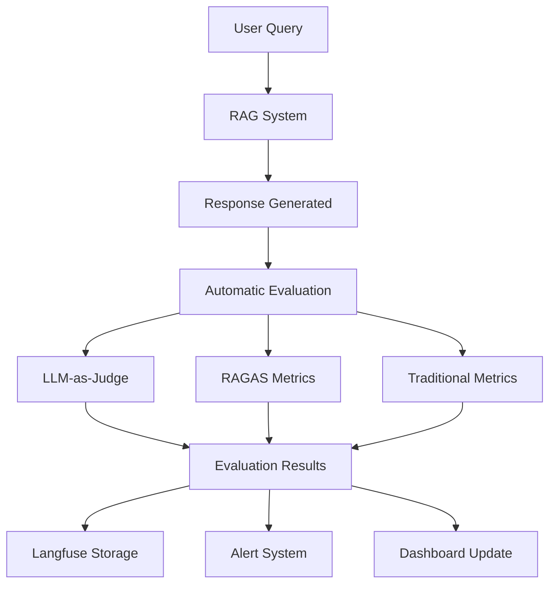

# Implementation Flow Strategy

## Strategic Approach: Backend-First with Early Wins

### Core Philosophy
**"Working RAG System in 3 Weeks"** - Build a minimal but functional RAG system that can process documents and answer questions, then iterate and enhance.

### Why Backend-First?
1. **Core Value Delivery**: RAG functionality is the core business value
2. **Technical Validation**: Validate AI/ML integration early
3. **API-First Design**: Frontend can be built against stable APIs
4. **Parallel Development**: Once APIs exist, frontend and backend can develop in parallel
5. **Early Testing**: Backend functionality can be tested via API calls/Postman

## Implementation Sequence

### 🏗️ **Phase 1: DevOps Foundation (Week 1)**
**Goal**: Get basic infrastructure running locally and deployable

#### Day 1-2: Local Development Environment
```bash
# Priority Order:
1. Docker Compose setup (PostgreSQL, Redis, Qdrant)
2. Basic FastAPI service structure
3. Database migrations (Alembic)
4. Environment configuration
```

#### Day 3-4: Core Infrastructure
```bash
# Infrastructure Setup:
1. Shared authentication middleware
2. Database connection pooling
3. Basic logging and monitoring
4. Health check endpoints
```

#### Day 5-7: Service Foundation
```bash
# Service Structure:
1. File Service skeleton
2. Collection Service skeleton  
3. API Gateway configuration
4. Basic error handling
```

**Deliverable**: Working local environment with all services running

### 🔧 **Phase 2: Core RAG Backend (Weeks 2-3)**
**Goal**: Functional RAG system that can process documents and answer questions

#### Week 2: Document Processing Pipeline
```python
# Implementation Priority:
1. File upload endpoint (PDF, TXT support only initially)
2. Text extraction (PyMuPDF for PDF, basic text for TXT)
3. Document chunking (simple fixed-size chunks)
4. Embedding generation (Gemini API integration)
5. Vector storage (Qdrant integration)
```

**Daily Targets**:
- **Day 1**: File upload and storage
- **Day 2**: Text extraction from PDF/TXT
- **Day 3**: Document chunking logic
- **Day 4**: Embedding generation integration
- **Day 5**: Vector database storage
- **Weekend**: Integration testing and bug fixes

#### Week 3: Search and Retrieval
```python
# Implementation Priority:
1. Vector similarity search
2. Basic context retrieval
3. LLM integration (Gemini API)
4. Simple response generation
5. Source attribution
```

**Daily Targets**:
- **Day 1**: Vector search implementation
- **Day 2**: Context ranking and selection
- **Day 3**: LLM API integration
- **Day 4**: Response generation with sources
- **Day 5**: End-to-end testing
- **Weekend**: Performance optimization

**Deliverable**: Working RAG system accessible via API calls

### 🌐 **Phase 3: API Layer (Week 4)**
**Goal**: Clean, documented APIs for all core functionality

#### API Development Priority:
```python
# Week 4 Focus:
1. Collection management APIs
2. Document upload/management APIs
3. Search/query APIs
4. User authentication APIs
5. OpenAPI documentation
```

**API Endpoints (MVP)**:
```
POST /api/v1/collections                    # Create collection
GET  /api/v1/collections                    # List collections
POST /api/v1/collections/{id}/documents     # Upload document
GET  /api/v1/collections/{id}/documents     # List documents
POST /api/v1/search                         # Search across collections
GET  /api/v1/documents/{id}/status          # Processing status
```

**Deliverable**: Complete API documentation and working endpoints

### 🎨 **Phase 4: Basic Frontend (Week 5)**
**Goal**: Simple but functional UI for demonstration and testing

#### Frontend Development Priority:
```typescript
# Week 5 Focus:
1. Basic React app setup
2. Collection management interface
3. Document upload interface
4. Simple search interface
5. Results display with sources
```

**UI Components (MVP)**:
- Collection list and creation
- File upload with progress
- Search box and results
- Source attribution display
- Basic responsive layout

**Deliverable**: Working web interface for all core functionality

### 🚀 **Phase 5: Advanced Features (Weeks 6+)**
**Goal**: Enhanced functionality and production readiness

#### Enhancement Priority:
```
# Weeks 6-8:
1. Multi-collection search
2. Chat interface with streaming
3. Advanced file type support (CSV, Audio)
4. User management and RBAC
5. Performance optimization

# Weeks 9-12:
1. Advanced chunking strategies
2. Context merging optimization
3. Analytics and monitoring
4. Production deployment
5. Security hardening
```

## Daily Development Workflow

### Morning Routine (30 minutes)
```bash
1. Check service health (docker-compose ps)
2. Review previous day's progress
3. Update progress.md with current status
4. Plan day's specific tasks
```

### Development Cycle (2-3 hour blocks)
```bash
1. Implement feature/component
2. Write basic tests
3. Test integration
4. Update documentation
5. Commit with clear message
```

### Evening Wrap-up (15 minutes)
```bash
1. Update progress.md
2. Note any blockers or issues
3. Plan next day's priorities
4. Commit all changes
```

## Technology Implementation Order

### Week 1: Infrastructure Stack
```yaml
# Technology Priority:
1. Docker & Docker Compose
2. PostgreSQL with Alembic
3. Redis for caching
4. Qdrant vector database
5. FastAPI basic structure
```

### Week 2-3: AI/ML Integration
```python
# Integration Priority:
1. Google Gemini 2.0 Flash API (primary RAG generation)
2. Google text-embedding-004 (primary embeddings)
3. LangGraph framework setup
4. LangChain utility components (text splitters, retrievers)
5. OpenAI GPT-4o API (fallback configuration)
6. OpenAI text-embedding-3-small (fast fallback embeddings)
7. PyMuPDF for PDF processing
8. Qdrant Python client with hybrid search
9. Advanced chunking algorithms (semantic, recursive)
10. Multi-stage retrieval pipeline (vector + BM25 + reranking)
11. Langfuse observability integration
```

### Week 4: API Development
```python
# API Stack:
1. FastAPI routers
2. Pydantic models
3. SQLAlchemy async
4. JWT authentication
5. OpenAPI documentation
6. LLM evaluation endpoints
7. Multi-provider LLM routing
8. Retrieval strategy configuration endpoints
9. Chunking strategy management APIs
```

### Week 5: Frontend Stack
```typescript
# Frontend Priority:
1. React 18 with TypeScript
2. Vite for build tooling
3. Axios for API calls
4. Basic CSS/Tailwind
5. React Router for navigation
```

## Early Win Milestones

### 🎯 **Week 1 Milestone**: "Infrastructure Running"
- All services start with `docker-compose up`
- Database migrations work
- Health checks pass
- Basic authentication works

### 🎯 **Week 2 Milestone**: "Document Processing"
- Can upload a PDF file
- Text extraction works
- Document stored in database
- Embeddings generated and stored

### 🎯 **Week 3 Milestone**: "Basic RAG Working"
- Can search for documents
- LLM generates responses
- Source attribution included
- End-to-end RAG pipeline functional

### 🎯 **Week 4 Milestone**: "API Complete"
- All APIs documented and tested
- Postman collection works
- Authentication integrated
- Error handling consistent

### 🎯 **Week 5 Milestone**: "Demo Ready"
- Web interface functional
- Can demo full workflow
- Upload → Process → Search → Answer
- Ready for user feedback

## Risk Mitigation Strategies

### Technical Risks
```python
# Risk: AI API Integration Issues
# Mitigation: Start with simple API calls, build complexity gradually
# Fallback: Use OpenAI APIs if Gemini has issues

# Risk: Vector Database Performance
# Mitigation: Start with small datasets, optimize later
# Fallback: Use Pinecone if Qdrant has issues

# Risk: Complex Microservices
# Mitigation: Start with monolithic structure, extract services later
# Fallback: Keep everything in one service initially
```

### Timeline Risks
```python
# Risk: Feature Creep
# Mitigation: Strict MVP scope, defer advanced features
# Strategy: "Working system first, perfect system later"

# Risk: Integration Complexity
# Mitigation: Test integrations early and often
# Strategy: Build integration tests from day 1

# Risk: Performance Issues
# Mitigation: Focus on functionality first, optimize later
# Strategy: Measure performance, don't guess
```

## Success Metrics

### Week 1 Success Criteria
- [ ] All services running locally
- [ ] Database migrations working
- [ ] Basic API endpoints responding
- [ ] Health checks passing

### Week 2 Success Criteria
- [ ] PDF upload and processing working
- [ ] Text extraction functional
- [ ] Embeddings generated successfully
- [ ] Vector storage operational

### Week 3 Success Criteria
- [ ] Search returning relevant results
- [ ] LLM generating coherent responses
- [ ] Source attribution working
- [ ] End-to-end RAG pipeline complete

### Week 4 Success Criteria
- [ ] All APIs documented and tested
- [ ] Authentication working
- [ ] Error handling consistent
- [ ] Performance acceptable (<3s response)

### Week 5 Success Criteria
- [ ] Web interface functional
- [ ] Complete user workflow possible
- [ ] Demo-ready system
- [ ] User feedback collection ready

## Development Tools & Practices

### Essential Tools
```bash
# Development:
- Docker Desktop
- VS Code with Python/TypeScript extensions
- Postman for API testing
- pgAdmin for database management

# Monitoring:
- Docker logs for debugging
- Basic health check endpoints
- Simple performance logging
```

### Code Quality Gates
```python
# Before each commit:
1. Code runs without errors
2. Basic tests pass
3. API endpoints respond correctly
4. No obvious security issues

# Before each milestone:
1. Integration tests pass
2. Performance within acceptable limits
3. Documentation updated
4. Demo scenario works end-to-end
```

## Parallel Development Strategy (Post-Week 4)

### Once APIs are stable:
```
Backend Team Focus:
- Performance optimization
- Advanced features
- Security hardening
- Production deployment

Frontend Team Focus:
- UI/UX improvements
- Advanced interactions
- Mobile responsiveness
- User experience optimization
```

This strategy ensures we have a working, demonstrable RAG system within 3 weeks, with clear milestones and risk mitigation. The backend-first approach allows for early validation of the core AI/ML functionality while building a solid foundation for the frontend.

## LLM Observability & Evaluation Strategy

### Observability Implementation (Week 2-4)

#### Week 2: Basic Observability Setup
```python
# Core Observability Components:
1. Langfuse self-hosted deployment (Docker)
2. LlamaIndex + Langfuse integration
3. Basic tracing for LLM calls
4. Token usage tracking
5. Response time monitoring
```

#### Week 3: Advanced Monitoring
```python
# Enhanced Observability:
1. Custom evaluation metrics
2. LLM-as-a-Judge implementation
3. RAGAS evaluation framework
4. Error tracking and alerting
5. Cost monitoring dashboard
```

#### Week 4: Evaluation Pipeline
```python
# Evaluation Infrastructure:
1. Golden dataset creation
2. Automated evaluation endpoints
3. A/B testing framework
4. Human evaluation interface
5. Evaluation result storage
```

### LLM-as-a-Judge Implementation

#### Evaluation Criteria
```python
# Multi-Dimensional Evaluation:
EVALUATION_DIMENSIONS = {
    "relevance": {
        "description": "How well does the response answer the question?",
        "scale": "1-5 (1=irrelevant, 5=highly relevant)",
        "weight": 0.3
    },
    "accuracy": {
        "description": "Is the information factually correct?",
        "scale": "1-5 (1=incorrect, 5=accurate)",
        "weight": 0.3
    },
    "completeness": {
        "description": "Does the response cover all aspects?",
        "scale": "1-5 (1=incomplete, 5=comprehensive)",
        "weight": 0.2
    },
    "attribution": {
        "description": "Are sources properly cited?",
        "scale": "1-5 (1=no sources, 5=perfect attribution)",
        "weight": 0.2
    }
}
```

#### Judge Model Configuration
```python
# LLM Judge Setup:
JUDGE_CONFIG = {
    "primary_judge": "gpt-4",
    "backup_judge": "gemini-pro",
    "consensus_threshold": 0.8,
    "explanation_required": True,
    "temperature": 0.1,  # Low temperature for consistent evaluation
    "max_tokens": 500
}
```

### Evaluation Metrics & KPIs

#### Technical Metrics
```python
# System Performance:
- Response latency (P50, P95, P99)
- Token usage per request
- Cost per query
- Error rates by component
- Retrieval accuracy (MRR, NDCG)

# Quality Metrics:
- LLM-as-Judge scores
- RAGAS evaluation scores
- Human evaluation ratings
- Source attribution accuracy
- Hallucination detection rate
```

#### Business Metrics
```python
# User Experience:
- User satisfaction scores
- Query success rate
- Time to answer
- Source click-through rate
- User retention metrics

# Operational Metrics:
- System uptime
- Processing throughput
- Storage efficiency
- Scaling performance
```

### Observability Technology Stack

#### Core Components
```yaml
# Observability Infrastructure:
langfuse:
  deployment: "self-hosted"
  database: "postgresql"
  features: ["tracing", "evaluation", "prompt_management"]

opentelemetry:
  exporters: ["langfuse", "prometheus"]
  instrumentation: ["llamaindex", "fastapi", "sqlalchemy"]

prometheus:
  metrics: ["system", "business", "custom"]
  retention: "30d"

grafana:
  dashboards: ["llm_performance", "business_kpis", "system_health"]
```

#### Integration Points
```python
# Observability Integration:
1. LlamaIndex automatic instrumentation
2. FastAPI middleware for request tracing
3. Custom decorators for business logic
4. Database query monitoring
5. External API call tracking
```

### Evaluation Pipeline Architecture

#### Automated Evaluation Flow


#### Evaluation Triggers
```python
# When to Evaluate:
1. Every production query (sampling for performance)
2. Scheduled batch evaluation (daily/weekly)
3. Model deployment validation
4. A/B test comparisons
5. Manual evaluation requests
```

### Implementation Priorities

#### Phase 1: Basic Observability (Week 2)
- [ ] Langfuse deployment and configuration
- [ ] LlamaIndex integration with tracing
- [ ] Basic metrics collection (latency, tokens, cost)
- [ ] Simple dashboard setup

#### Phase 2: Evaluation Framework (Week 3)
- [ ] LLM-as-a-Judge implementation
- [ ] RAGAS integration
- [ ] Golden dataset creation (50-100 examples)
- [ ] Automated evaluation pipeline

#### Phase 3: Advanced Monitoring (Week 4)
- [ ] Custom evaluation metrics
- [ ] A/B testing framework
- [ ] Human evaluation interface
- [ ] Alert system configuration

#### Phase 4: Production Optimization (Week 5+)
- [ ] Performance optimization based on metrics
- [ ] Evaluation result analysis
- [ ] Model improvement recommendations
- [ ] Continuous evaluation automation

This comprehensive observability and evaluation strategy ensures we can monitor, measure, and continuously improve our RAG system's performance from day one.

## LangGraph Architecture & Multi-Provider Strategy

### LangGraph Agent Design (Week 2-3)

#### Core Agent Architecture
```python
# LangGraph RAG Agent Structure:
1. Document Ingestion Agent - Handles file processing and chunking
2. Retrieval Agent - Manages vector search and context selection
3. Generation Agent - Handles LLM response generation
4. Evaluation Agent - Monitors and evaluates responses
5. Orchestrator Agent - Coordinates the entire workflow
```

#### LangGraph State Management
```python
# Agent State Schema:
class RAGState(TypedDict):
    query: str
    documents: List[Document]
    retrieved_chunks: List[Chunk]
    context: str
    response: str
    sources: List[str]
    evaluation_scores: Dict[str, float]
    provider_used: str  # "gemini" or "openai"
    retry_count: int
```

#### Multi-Provider Fallback Implementation
```python
# Fallback Strategy in LangGraph:
def create_llm_with_fallback():
    primary_llm = ChatGoogleGenerativeAI(
        model="gemini-2.0-flash",
        temperature=0.1,
        timeout=30,
        max_retries=2
    )
    
    fallback_llm = ChatOpenAI(
        model="gpt-4o",
        temperature=0.1,
        timeout=30,
        max_retries=2
    )
    
    return primary_llm.with_fallbacks([fallback_llm])

# LangGraph Node with Intelligent Model Selection:
def generation_node(state: RAGState) -> RAGState:
    query_complexity = assess_complexity(state["query"])
    
    try:
        if query_complexity == "simple":
            # Use Gemini 2.0 Flash for fast, simple queries
            llm = ChatGoogleGenerativeAI(model="gemini-2.0-flash")
            state["provider_used"] = "gemini-flash"
        else:
            # Use Gemini 1.5 Pro for complex queries
            llm = ChatGoogleGenerativeAI(model="gemini-1.5-pro")
            state["provider_used"] = "gemini-pro"
            
        response = llm.invoke(state["context"])
        
    except Exception as e:
        # Fallback to OpenAI based on complexity
        if query_complexity == "simple":
            llm = ChatOpenAI(model="gpt-4o-mini")
            state["provider_used"] = "openai-mini"
        else:
            llm = ChatOpenAI(model="gpt-4o")
            state["provider_used"] = "openai-4o"
            
        response = llm.invoke(state["context"])
        state["retry_count"] += 1
    
    state["response"] = response.content
    return state

def assess_complexity(query: str) -> str:
    """Assess query complexity for model selection"""
    # Simple heuristics - can be enhanced with ML
    if len(query.split()) > 50 or "analyze" in query.lower() or "compare" in query.lower():
        return "complex"
    return "simple"
```

### Implementation Priorities

#### Week 2: LangGraph Foundation
- [ ] LangGraph + LangChain installation and setup
- [ ] Basic agent state schema definition
- [ ] Simple linear workflow (ingest → retrieve → generate)
- [ ] Gemini API integration with error handling
- [ ] OpenAI fallback configuration

#### Week 3: Advanced Agent Features
- [ ] Multi-node agent workflow
- [ ] State persistence and recovery
- [ ] Provider switching logic
- [ ] Performance monitoring per provider
- [ ] Evaluation agent integration

#### Week 4: Production Readiness
- [ ] Error handling and retry logic
- [ ] Provider health monitoring
- [ ] Cost tracking per provider
- [ ] A/B testing between providers
- [ ] Automated fallback triggers

## Retrieval & Chunking Implementation Strategy

### Multi-Stage Retrieval Pipeline (Week 3)

#### Stage 1: Document Processing & Chunking
```python
# Adaptive Chunking Implementation:
class ResearchBasedChunker:
    def __init__(self):
        self.strategies = {
            # Primary strategy - semantic chunking (best performance)
            "semantic": SemanticChunker(
                chunk_size=512, 
                overlap=128,  # 25% overlap (research optimal)
                similarity_threshold=0.8
            ),
            
            # Document-type optimized strategies
            "pdf_academic": SemanticSectioningChunker(
                chunk_size=768,  # Larger for academic context
                overlap=192,     # 25% overlap maintained
                respect_headers=True,
                preserve_citations=True
            ),
            
            "pdf_technical": HybridSemanticStructureChunker(
                chunk_size=512,
                overlap=128,
                respect_code_blocks=True,
                preserve_diagrams=True
            ),
            
            "markdown": HeaderBasedSemanticChunker(
                chunk_size=512,
                overlap=128,
                respect_structure=True,
                preserve_code_examples=True
            ),
            
            "conversational": DialogueAwareChunker(
                chunk_size=256,  # Smaller for conversations
                overlap=64,
                preserve_speaker_turns=True
            ),
            
            # Fallback strategy
            "recursive": RecursiveCharacterChunker(
                chunk_size=512,
                overlap=128,
                separators=["\n\n", "\n", ". ", "! ", "? ", " "]
            )
        }
    
    def chunk_document(self, document, file_type, query_type=None):
        # Query-adaptive sizing
        if query_type:
            chunk_size = self.get_optimal_size_for_query(query_type)
            self.adjust_chunk_sizes(chunk_size)
        
        # Select strategy based on document type
        strategy_key = self.select_strategy(file_type)
        chunker = self.strategies.get(strategy_key, self.strategies["semantic"])
        
        return chunker.split(document)
    
    def get_optimal_size_for_query(self, query_type):
        """Research-based query-adaptive chunk sizing"""
        size_map = {
            "fact_retrieval": 256,      # Precise keyword matching
            "conceptual": 512,          # Balanced understanding
            "complex_reasoning": 1024,  # Broader context needed
            "summarization": 768        # Comprehensive coverage
        }
        return size_map.get(query_type, 512)  # Default to research optimal
```

#### Stage 2: Hybrid Search Implementation
```python
# Multi-Vector Retrieval Strategy:
class HybridRetriever:
    def __init__(self):
        self.vector_store = QdrantVectorStore()
        self.bm25_retriever = BM25Retriever()
        self.reranker = CrossEncoderReranker("ms-marco-MiniLM-L-6-v2")
    
    async def retrieve(self, query: str, top_k: int = 5):
        # Stage 1: Broad vector search
        vector_results = await self.vector_store.similarity_search(
            query, k=20, threshold=0.6
        )
        
        # Stage 2: Keyword boost with BM25
        bm25_results = self.bm25_retriever.get_relevant_documents(
            query, k=10
        )
        
        # Stage 3: Combine and rerank
        combined = self.combine_results(vector_results, bm25_results)
        reranked = await self.reranker.rerank(query, combined, top_k=10)
        
        # Stage 4: MMR for diversity
        final_results = self.mmr_selection(reranked, top_k=top_k)
        
        return final_results
```

#### Stage 3: Context Assembly Strategy
```python
# Smart Context Assembly:
class ContextAssembler:
    def __init__(self, max_tokens=4000):
        self.max_tokens = max_tokens
        self.tokenizer = tiktoken.get_encoding("cl100k_base")
    
    def assemble_context(self, chunks, strategy="weighted_selection"):
        if strategy == "simple_concatenation":
            return self.simple_concat(chunks)
        elif strategy == "weighted_selection":
            return self.weighted_selection(chunks)
        elif strategy == "mmr_diversification":
            return self.mmr_diversification(chunks)
    
    def weighted_selection(self, chunks):
        # Score chunks based on multiple factors
        scored_chunks = []
        for chunk in chunks:
            score = (
                chunk.similarity_score * 0.4 +
                chunk.keyword_match_score * 0.3 +
                chunk.recency_score * 0.2 +
                chunk.authority_score * 0.1
            )
            scored_chunks.append((chunk, score))
        
        # Select chunks within token limit
        return self.select_within_limit(scored_chunks)
```

### Implementation Timeline

#### Week 3: Core Retrieval Implementation
- **Day 1**: Basic vector search with Qdrant
- **Day 2**: BM25 keyword search integration
- **Day 3**: Cross-encoder reranking setup
- **Day 4**: MMR diversity selection
- **Day 5**: Context assembly and token management

#### Week 4: Advanced Features
- **Day 1**: Adaptive chunking strategies
- **Day 2**: Document-type specific processing
- **Day 3**: Retrieval strategy configuration APIs
- **Day 4**: Performance optimization and caching
- **Day 5**: Integration testing and evaluation

### Retrieval Configuration Management

#### Dynamic Strategy Selection
```python
# Configurable Retrieval Strategies:
RETRIEVAL_STRATEGIES = {
    "fast": {
        "vector_top_k": 10,
        "reranking": False,
        "mmr": False,
        "use_case": "Quick responses, high volume"
    },
    "balanced": {
        "vector_top_k": 20,
        "bm25_boost": True,
        "reranking": True,
        "rerank_top_k": 10,
        "mmr": True,
        "final_k": 5,
        "use_case": "Standard RAG queries"
    },
    "comprehensive": {
        "vector_top_k": 50,
        "bm25_boost": True,
        "reranking": True,
        "rerank_top_k": 20,
        "mmr": True,
        "final_k": 8,
        "use_case": "Complex research queries"
    }
}
```

#### Performance Optimization
```python
# Caching and Performance:
PERFORMANCE_CONFIG = {
    "embedding_cache": {
        "enabled": True,
        "ttl": 3600,  # 1 hour
        "max_size": 10000
    },
    "retrieval_cache": {
        "enabled": True,
        "ttl": 300,   # 5 minutes
        "max_size": 1000
    },
    "async_processing": {
        "enabled": True,
        "max_concurrent": 10,
        "timeout": 30
    }
}
```

---
*Last Updated: Current Session*
*Next Update: After implementation begins* 